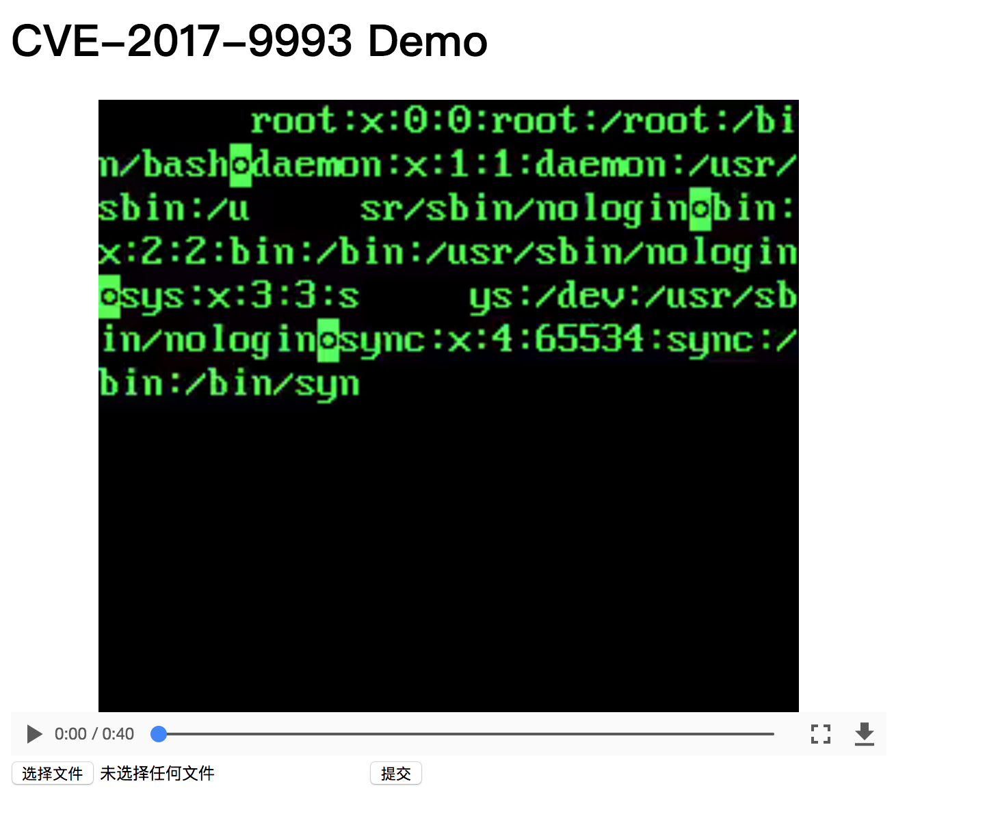

## FFmpeg 文件读取漏洞(CVE-2017-9993)

### 漏洞信息

FFmpeg是一个完整的跨平台解决方案，用于记录、转换流式传输音频和视频，可用于预览生成和视频转换的视频编码软件。已知FFmpeg可以处理可能包含对外部文件的引用的HLS播放列表,可以使用AVI文件中的GAB2字幕块来触发此功能，再通过XBIN编解码器检索转换节点的本地文件，从而导致了可以在转码后的视频里包含了本地文件.

### 影响范围

小于 2.8.12, 3.0.x 以及 3.1.x 版本小于 3.1.9, 3.2.x 小于 3.2.6, 以及 3.3.x 版本小于 3.3.2

### 镜像信息

类型 | 值
:-:|:-:
FFmpeg | 3.1.3
HTTP 端口 | 80
镜像 tag | f_ffmpeg_1

### 获取环境:

1. 拉取镜像到本地

 ```
$ docker pull medicean/vulapps:f_ffmpeg_1
 ```

2. 启动环境

 ```
$ docker run -d -p 8000:80 medicean/vulapps:f_ffmpeg_1
 ```
 > `-p 8000:80` 前面的 8000 代表物理机的端口，可随意指定。 

 访问 http://127.0.0.1:8000 


### POC

> 假如目标地址为： http://127.0.0.1:8000/

使用该脚本用于生成 POC: https://github.com/neex/ffmpeg-avi-m3u-xbin

以读取 `/etc/passwd` 为例：

1. 生成特殊的视频文件

```
$ python3 gen_xbin_avi.py file:///etc/passwd passwd.avi
```

2. 上传 [passwd.avi](./passwd.avi) 到目标，即可看到如下结果：




### 相关链接

* [CVE-2017-9993 Detail](https://nvd.nist.gov/vuln/detail/CVE-2017-9993)
* [ffmpeg-avi-m3u-xbin](https://github.com/neex/ffmpeg-avi-m3u-xbin)
* [FFmpeg 安全问题讨论](http://paper.seebug.org/338/)
