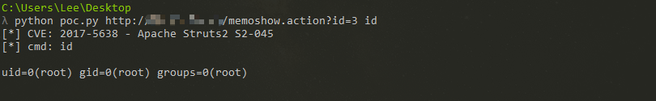

## Struts2_Jakarta_Plugin插件远程代码执行漏洞(S2-045) 环境

### 漏洞信息

 * [S2-045 公告](https://cwiki.apache.org/confluence/display/WW/S2-045)

### 获取环境:

1. 拉取镜像到本地

 ```
$ docker pull medicean/vulapps:s_struts2_s2-045
 ```

2. 启动环境

 ```
$ docker run -d -p 80:8080 medicean/vulapps:s_struts2_s2-045
 ```
 > `-p 80:8080` 前面的 80 代表物理机的端口，可随意指定。 

### 使用与利用

访问 `http://你的 IP 地址:端口号/`

#### PoC

运行 `poc.py`

 ```
$ python poc.py <url> <cmd>
 ```


