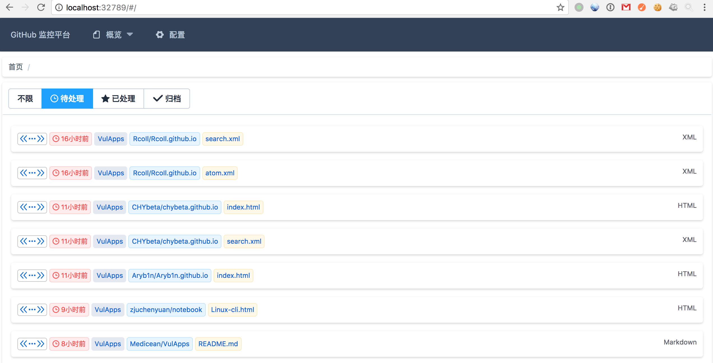

Hawkeye
---

项目地址：[https://github.com/0xbug/Hawkeye](https://github.com/0xbug/Hawkeye)

工具作者：0xbug

### 工具简介

**Hawkeye**是用来监控 github 代码库，及时发现员工托管公司代码到 GitHub 行为并预警，降低代码泄露风险


### 镜像信息

类型 | 用户名 | 密码
:-:|:-:|:-:
mongodb | 空 | 空
Hawkeye路径 | /opt/hawkeye | -
Hawkeye 端口 | 80 | -

### 获取环境

1. 拉取镜像到本地

 ```
$ docker pull medicean/vulapps:tools_hawkeye
 ```

2. 启动环境

 ```
$ docker run -d -p 8000:80 -e GITHUB_USER=xxxx -e GITHUB_PASSWORD=xxxx medicean/vulapps:tools_hawkeye
 ```
 > `-p 8000:80` 前面的 8000 代表物理机的端口，可随意指定。 
 > 必须设置 Github 账号密码才能启动成功，具体看下面

 **Github 账号设置（必须）**

类型 | 环境变量名 | 默认 | 是否必须
:-:|:-:|:-:|:-:
GitHub账号 | `GITHUB_USER` | - | 是
GitHub密码 | `GITHUB_PASSWORD` | - | 是

访问: `http://127.0.0.1:8000/` 正常访问则代表安装成功

 > 注意，不要开二次认证

 **邮件服务设置**
 > 如果需要自动设置邮件服务，则需要在启动时指定环境变量
 
 类型 | 环境变量名 | 默认 
:-:|:-:|:-:
邮箱账号 | `MAIL_USER` | -
邮箱密码 | `MAIL_PASSWORD` | -
SMTP服务器 | `MAIL_SERVER` | smtp.qq.com
SMTP服务器端口 | `MAIL_PORT` | 587

 eg: 指定一个 QQ 邮箱来作为发信邮箱(默认使用的是QQ的发信服务器，所以不需要设置)：
 
 ```
 $ docker run -d -p 8000:80 -e GITHUB_USER=xxxx -e GITHUB_PASSWORD=xxxx -e MAIL_USER =546074829@qq.com -e MAIL_PASSWORD=123456 medicean/vulapps:tools_hawkeye
 ```

 > 如果使用QQ邮箱，这里不需要使用真实的密码，可在 QQ 邮箱-> 设置 -> 账户 中设置授权码

### 截图


